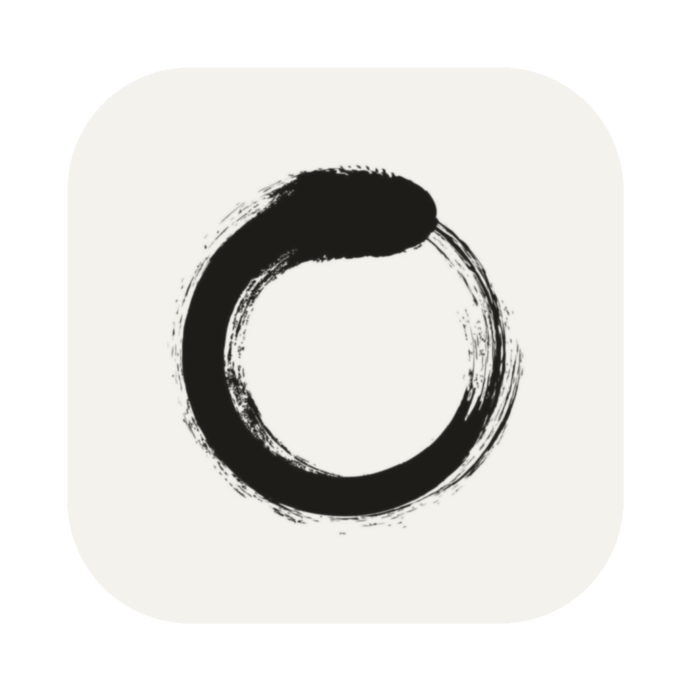
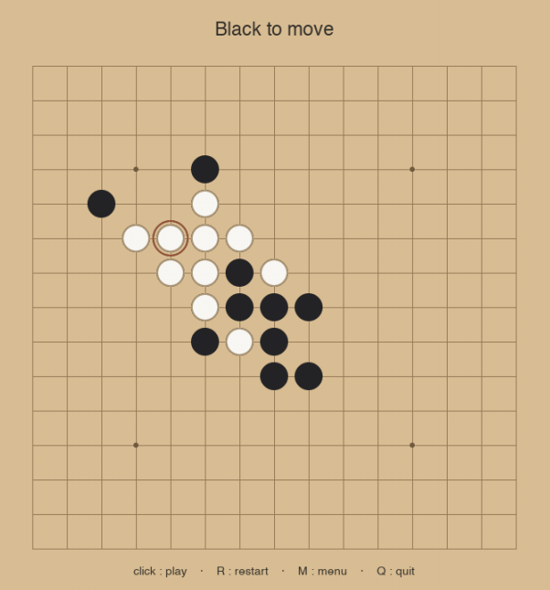

<p align="center">
  
</p>

<h1 align="center">FiveZero</h1>

<p align="center">A Gomoku (five-in-a-row) engine &amp; desktop game, written in Python.</p>

<p align="center">
  
</p>

---

## The game

Classic Gomoku on a 15×15 board — line up five stones to win. Play **human vs engine**, **human vs human**, or drop two engine versions into the **AI-vs-AI arena** and watch them fight a scored series.

## How the engine works

FiveZero picks its move with **iterative-deepening alpha-beta minimax** under a per-move time budget: it searches depth 1, then 2, then 3… and plays the best move from the deepest search it finished before the clock ran out.

- **Evaluation** — the position is scored by recognising line patterns (open twos and threes, fours, five-in-a-row…), summed as *engine minus opponent*. The side to move gets a **tempo** bonus, since having the initiative is worth something.
- **Incremental evaluation** — rather than rescanning the whole board at every leaf, the engine keeps a running per-colour score and updates only the few line segments passing through the square just played. Leaf evaluation is therefore O(1).
- **Move ordering** — candidates are ordered to make alpha-beta prune earlier, which buys extra search depth for free.
- **Randomised tie-break** — among equally-best moves one is chosen at random, so otherwise-identical games diverge (essential for fairly benchmarking two versions).
- **Speed** — the hot loops are JIT-compiled to native code with Numba.

Colours: black is `1`, white is `2`, empty is `0`; black always moves first.

## Run from source

```bash
pip install pygame numba numpy profilehooks
python main.py
```

## Build the macOS app

The bundled script packages everything into a double-clickable `.app` (and a `.zip` to send).

```bash
chmod +x distribution/build.sh   # once
./distribution/build.sh
```

It generates the icon, builds with PyInstaller, and drops both files in `distribution/`:

- **`Gomoku.app.zip`** — the file to share
- **`Gomoku.app`** — unzipped alongside, for local testing

Notes: macOS only, and the build is architecture-specific — the recipient's Mac must match (`uname -m`: `arm64` = Apple Silicon, `x86_64` = Intel). Since the app isn't Apple-signed, the **first** launch needs a right-click → *Open* → confirm; after that, double-click works normally.

---

<p align="center"><sub>A personal project. Named after AlphaZero.</sub></p>
